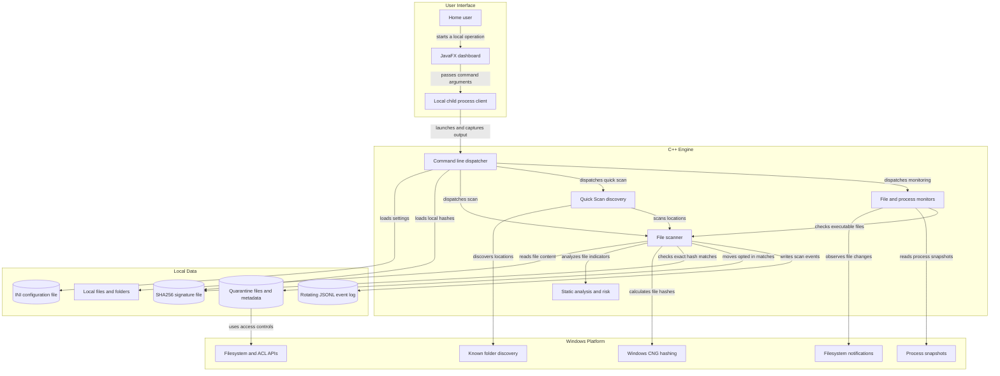
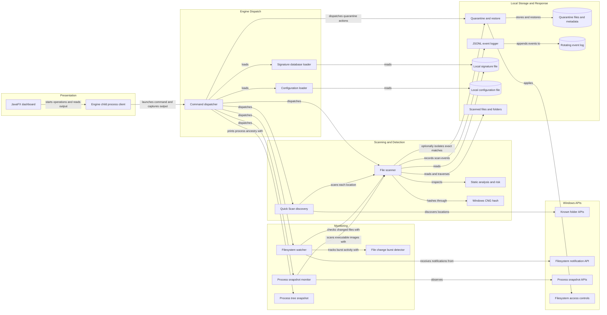

# Architecture Diagram

This document describes the current Sentinel AV prototype as found in the
repository. The commercial product direction in the roadmap is aspirational:
there is currently no Windows service, kernel driver, cloud API, or production
update backend in this architecture.

## Application Architecture

<!-- mermaid-checked: no \n, no em-dash/en-dash, no {} in labels, subgraphs are id["label"], arrows are -->|"label"|, all subgraphs closed by end, ids unique -->

### Technology Stack Summary

| Layer | Technology | Version | Purpose |
|---|---|---|---|
| User interface | Java and JavaFX | Java compiler release 25; JavaFX 21.0.6 | Local desktop dashboard and operation controls |
| UI to engine | Java `ProcessBuilder` | Java standard library | Launches the local engine and captures combined child-process output |
| Scanning engine | C++ | C++17 | File scanning, risk analysis, monitoring, quarantine, configuration, and logging |
| Native platform | Windows APIs | Windows version not pinned in the build | CNG SHA-256, known folders, filesystem notifications, process snapshots, and access controls |
| C++ build | CMake | Minimum 3.16 | Builds the Windows-only engine and core tests |
| Java build and tests | Maven Wrapper, JUnit Jupiter | Maven wrapper distribution pinned by project; JUnit 5.11.4 | Builds dashboard and runs Java unit tests |
| Java UI dependency | OpenJFX | 21.0.6 | Desktop controls and presentation |
| Local configuration | INI-like key/value file | Project-defined format | Signature path, event-log path, and quarantine directory |
| Local event storage | JSON Lines file | Project-defined format | Rotating local operational events |
| Local threat data | Text hash database | SHA-256 entries | Prototype exact-hash matching; data is not authenticated |
| Quarantine storage | Local filesystem files and metadata | Project-defined format | Stores opted-in exact-signature matches and restore metadata |

### Data Storage & External Services

The prototype stores configuration, signatures, event logs, quarantined files,
and quarantine metadata on the local filesystem. It has no database, cache,
message broker, remote API, cloud reputation service, or authenticated
intelligence-update service. Windows CNG supplies SHA-256 operations; Windows
APIs provide filesystem, known-folder, process-snapshot, and access-control
functions. Signature authenticity and cloud data retention are not implemented
in the current application.

### Key Architectural Decisions

- The JavaFX dashboard starts the C++ engine as a local child process; command
  arguments and captured output are the integration boundary. No local network
  listener is implemented.
- The C++ command dispatcher coordinates scanning and monitoring modules; the
  scanner combines exact local hash matching with bounded static indicators
  and rule-based risk scoring.
- Quarantine is opt-in and filesystem-backed. Current user-mode monitoring is
  best-effort and alert-oriented; it is not a Windows service or kernel
  enforcement layer.

## Component Relationships

<!-- mermaid-checked: no \n, no em-dash/en-dash, no {} in labels, subgraphs are id["label"], arrows are -->|"label"|, all subgraphs closed by end, ids unique -->

### Component Inventory

| Component | Layer | Type | Responsibility |
|---|---|---|---|
| SentinelDashboard | Presentation | JavaFX application | Presents scan, monitoring, settings, event, and quarantine controls |
| EngineClient | Presentation integration | Java child-process client | Starts one engine command, reads output, reports completion, and requests stop |
| CLI dispatcher | Engine dispatch | C++ command-line entry point | Parses commands and options, loads configuration and signatures, and invokes operations |
| Configuration loader | Engine dispatch | C++ configuration module | Validates local engine settings and resolves configured paths |
| Signature database loader | Engine dispatch | C++ data loader | Loads strict local SHA-256 entries and labels |
| Quick Scan discovery | Scanning | C++ scan coordinator | Finds current-user Downloads, Temp, and Startup roots and aggregates scan results |
| File scanner | Scanning | C++ scan and response module | Traverses file targets, hashes files, reports matches, and optionally quarantines exact matches |
| Static analysis and risk | Detection | C++ analysis module | Extracts bounded file indicators and produces explainable file-level risk assessments |
| Windows CNG hash | Platform service | Windows cryptographic API | Calculates SHA-256 for file content |
| Filesystem watcher | Monitoring | Windows user-mode watcher | Observes changes in a manually selected directory and scans stable changed files |
| File change burst detector | Monitoring | C++ heuristic | Emits alert-only signals for bursts of changed paths; does not attribute or stop a process |
| Process snapshot monitor | Monitoring | Windows user-mode polling | Detects observed new process snapshots and scans accessible executable images |
| Process tree snapshot | Monitoring | Windows process snapshot view | Displays point-in-time parent and child process relationships |
| Quarantine and restore | Local response | Filesystem-backed C++ module | Moves opted-in exact matches, stores local metadata, lists entries, and verifies hash on restore |
| JSONL event logger | Local observability | C++ local logger | Appends structured local events and rotates the active event file |
| Local files and folders | Data | User filesystem | Source targets for on-demand and monitoring scans |
| Signature/configuration files | Data | Local text files | Store local hash entries and engine configuration |
| Quarantine files and metadata | Data | Local protected filesystem paths | Hold explicitly quarantined files and associated restore metadata |
| Rotating event log | Data | Local JSON Lines file | Stores engine events without remote collection |

The commercial service, signed kernel component, cloud reputation/update
backend, browser integration, and production installer are target components
from the roadmap, not components currently present in the repository.
