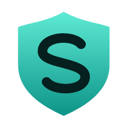
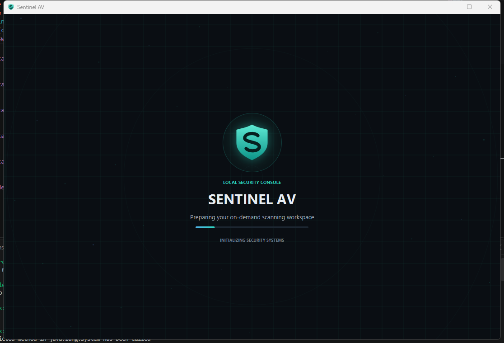
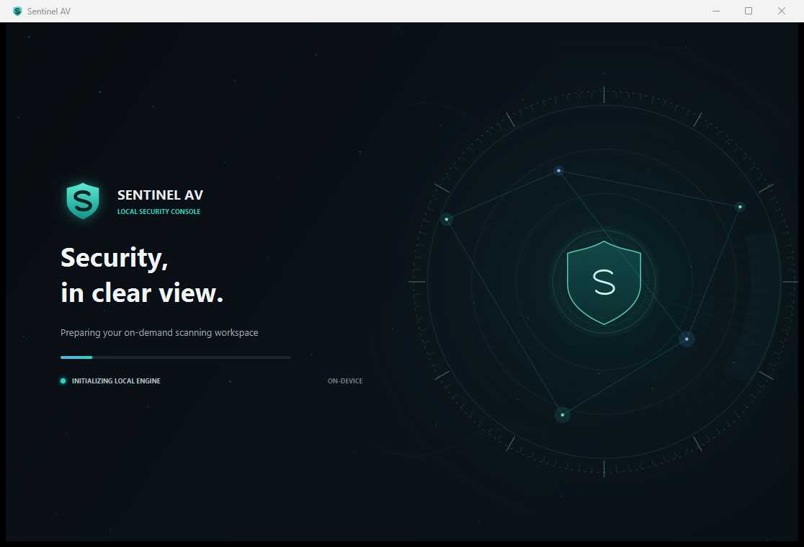

# Sentinel AV

<p align="center">
  
</p>

<p align="center">
  <strong>A Windows endpoint-security prototype built with C++17 and JavaFX.</strong><br>
  Local scanning, explainable static indicators, best-effort monitoring, and a native desktop console.
</p>

<p align="center">
  <a href="https://github.com/ArgirisViv/sentinel-antivirus/actions/workflows/ci.yml">
    
  </a>
  
  
  
</p>

> **Honest scope:** Sentinel AV is an educational prototype, not production
> antivirus software. Scanning and monitoring are best-effort; it does not
> block threats or provide always-on protection.

## Screenshots

<p align="center">
  
</p>

<p align="center">
  
</p>

## Highlights

- Native Windows C++17 scanner using Windows CNG SHA-256 and a strict, local
  signature database.
- Exact EICAR standard test-file detection from a bounded content prefix,
  clearly labelled as a harmless test pattern rather than malware.
- Separates exact signature matches from explainable static indicators; risk
  scores are prioritization signals, not probabilities.
- Optional quarantine for exact signature/EICAR test detections, with
  restricted ACLs on newly created locations, local history, and hash-checked
  restore.
- Best-effort recursive file monitoring, process-start snapshots, and
  alert-only file-change burst heuristic.
- JavaFX desktop console supervises the local engine process and streams its
  output; no network listener or cloud service.
- Windows CI, automated C++/Java tests, a threat model, and architecture docs.

## Try it on Windows

Requirements: CMake 3.16+ and a C++17 Windows compiler (for example Visual
Studio Build Tools).

```powershell
cmake -S . -B build
cmake --build build --config Release
ctest --test-dir build -C Release --output-on-failure
.\scripts\demo-safe.ps1
```

The demo uses harmless text fixtures, including the well-known `abc` hash
vector, in a temporary directory. It demonstrates report-only scanning and
explicit quarantine, then removes its files. Sentinel also recognizes the
exact standard EICAR test string within a bounded 128-byte file prefix; this
is a specific harmless test-pattern check, not a malware signature or evidence
of general malware-detection capability. The separate
[EICAR demo](scripts/demo-eicar.ps1) is opt-in because other antivirus
products may flag or quarantine its fixture.

## Run the desktop app

Download the **Windows x64 ZIP** from [GitHub Releases](https://github.com/ArgirisViv/sentinel-antivirus/releases/latest),
extract the complete folder, and launch `SentinelAV.exe`. No separate Java
installation is needed for the packaged app.

To build it yourself, install JDK 25+ with `jpackage`, build the C++ engine,
then run:

```powershell
Copy-Item .\build\Release\sentinel-av.exe .\build\sentinel-av.exe
.\scripts\package-app.ps1
```

The app image is written to `dist\SentinelAV`. Keep its folder contents
together.

## Documentation

- [Usage and CLI reference](docs/usage.md)
- [Architecture](docs/architecture.md)
- [Threat model and limitations](docs/threat-model.md)

## Future work

Potential engineering follow-ups include broader benign-corpus validation,
parser fuzzing, measured scan-performance baselines, stronger UI-level
automated tests, and splitting the JavaFX dashboard into smaller page
components. These are proposed improvements, not implemented product claims.
