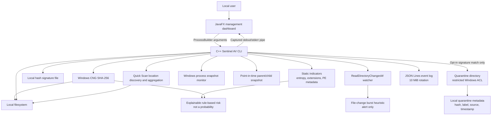

# Sentinel AV Architecture

Sentinel AV is a Windows-only learning project. The C++ engine owns file
scanning and local monitoring. The JavaFX application is a local management
client that starts the engine as a child process.

## Components

- **C++ CLI:** `scan`, `quick-scan`, `watch`, and `processes` commands. File signature
  matches are definitive detections; static heuristics are separate indicators.
- **Hash and signatures:** SHA-256 through Windows CNG, compared against a
  strict local text database.
- **Static analysis:** Samples at most 1 MiB for entropy and reads bounded PE
  headers/section flags without loading or executing a file.
- **Risk classification:** Combines documented static-indicator category
  weights, counting only the strongest finding in each category. It reports
  reasons and keeps exact configured-database matches distinct from heuristic
  severity. The score is not a probability or proof of malware.
- **Monitoring:** Recursive filesystem notifications and periodic process
  snapshots. Both are best-effort and can miss events.
- **File-change burst heuristic:** Emits an alert when at least 32 distinct
  paths change in a 10-second window during manual folder monitoring. It has no
  process attribution and performs no blocking, termination, or rollback.
- **Process tree:** Builds a point-in-time parent/child view from one Windows
  process snapshot. It is not continuous event telemetry.
- **Quick Scan:** Discovers the current user's Downloads and Startup known
  folders plus the temporary directory, then scans each existing unique
  location and aggregates results. It does not cover all of AppData or active
  process images.
- **Quarantine:** Explicit opt-in, same-volume rename. Newly-created
  quarantine directories and moved files receive protected ACLs for the
  current user, LocalSystem, and local Administrators. A restricted local
  sidecar records the original path, hash, signature label, and timestamp;
  restore refuses to overwrite an existing destination.
- **Configuration and events:** Strict key/value config; append-only JSONL
  events with one 10 MiB active log and one rotated backup.
- **JavaFX client:** Starts a local engine process with `ProcessBuilder`, reads
  its output pipe, and provides controls and event display. No TCP server,
  remote API, or network listener is implemented.

## Data flow

1. A user starts a CLI operation directly or through the JavaFX client.
2. The engine validates configuration and loads the local signature database.
3. A scan gathers static indicators, hashes each regular file, and reports
   matching signatures separately from heuristic context.
4. Quarantine, when explicitly enabled, moves only hash-matched files and
   applies a restricted ACL and records local metadata for later review/restore.
5. Structured event records are appended to the configured local log.

## Operational limitations

The engine is not a Windows service, does not prevent file execution, and does
not provide a kernel driver, process-attributed behavior, network/web
reputation, cloud intelligence, signature updates, or guaranteed real-time
coverage. The burst heuristic is observational only and may be noisy. Process
monitoring polls snapshots and may miss short-lived processes. Run a full scan
for a baseline and after watcher overflow.
